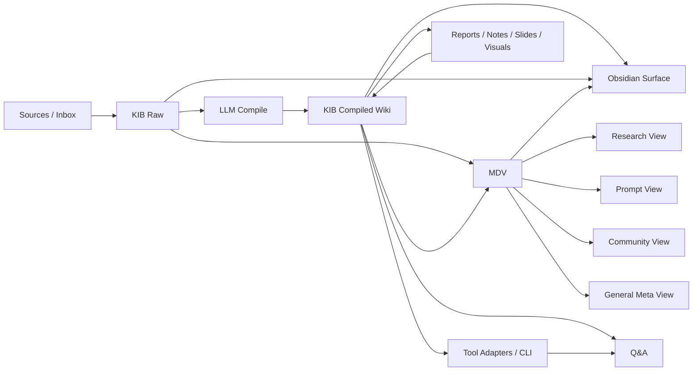

# Agent Brain 구조도 v1

작성일: 2026-04-03
상태: 초안

## 1. 개요

Agent Brain은 전체 LLM Knowledge System(LKS) 프로젝트다.

- **LKS**: 전체 체계
- **KIB**: raw/compiled 정보를 보관하고 열람하는 기반
- **MDV**: KIB를 다양한 차원으로 해석하는 메타 뷰 계층

## 2. 구조도

## 3. 해설

### KIB
- raw source 와 compiled knowledge 를 함께 보관한다.
- 사람이 읽는 자료와 LLM이 다시 읽는 자료가 모두 존재한다.

### MDV
- KIB 자체를 다시 저장소처럼 복제하기보다, KIB를 바라보는 해석 계층이다.
- 필요에 따라 research, prompt, community 같은 관점을 만든다.

### 출력과 환류
- Q&A와 보고서, 슬라이드 같은 산출물은 다시 compiled 쪽으로 환류될 수 있다.
- 이로써 Agent Brain은 정적 저장소가 아니라 성장하는 체계가 된다.
