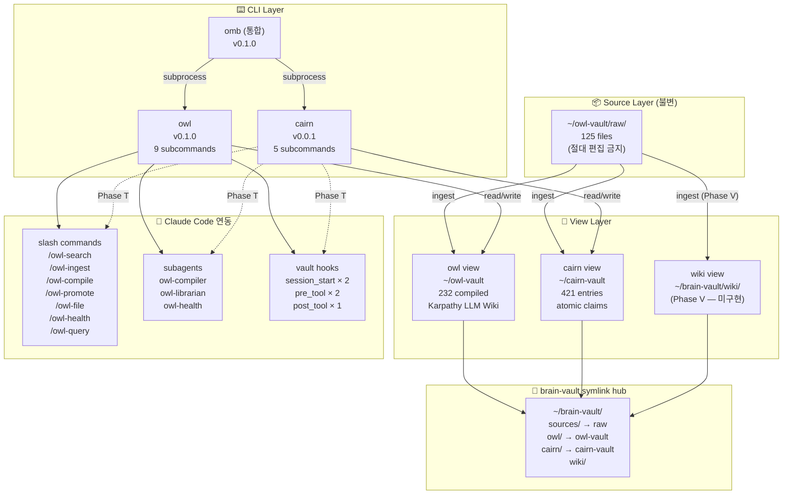
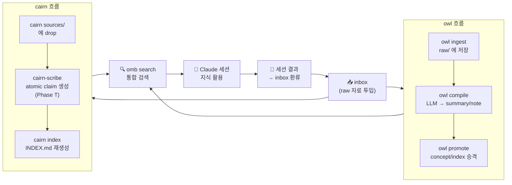
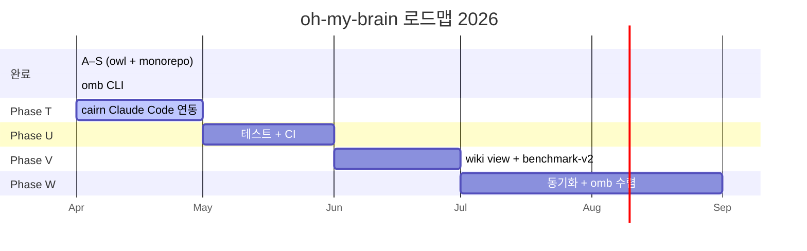
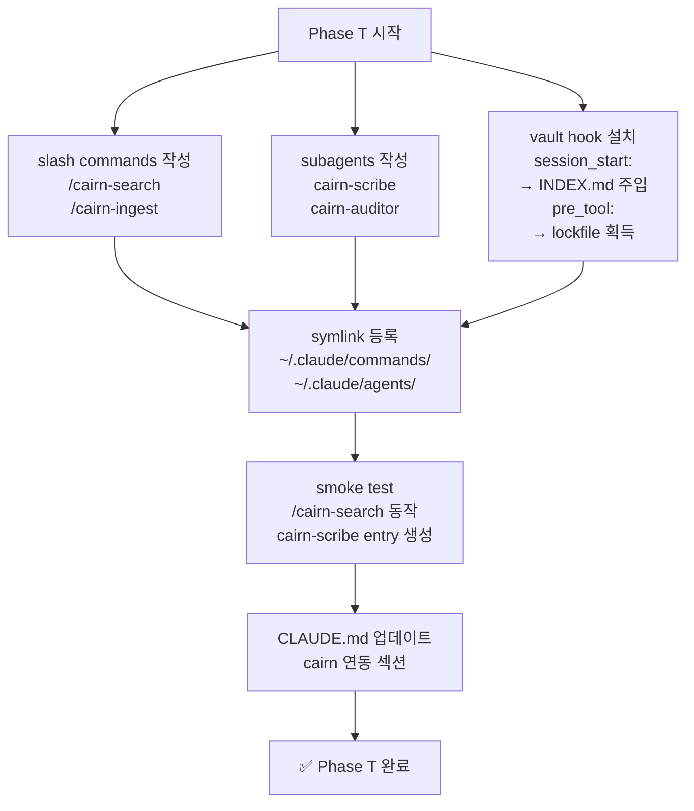
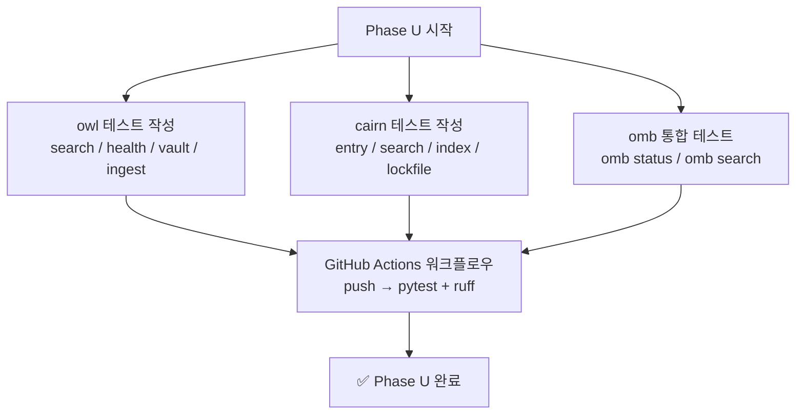
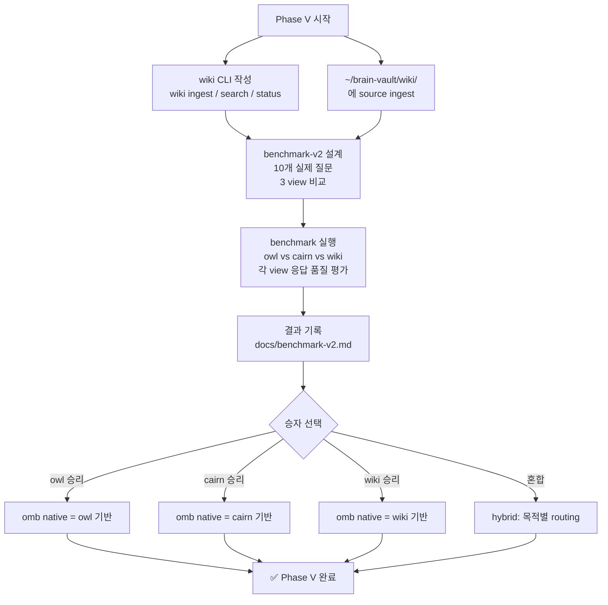
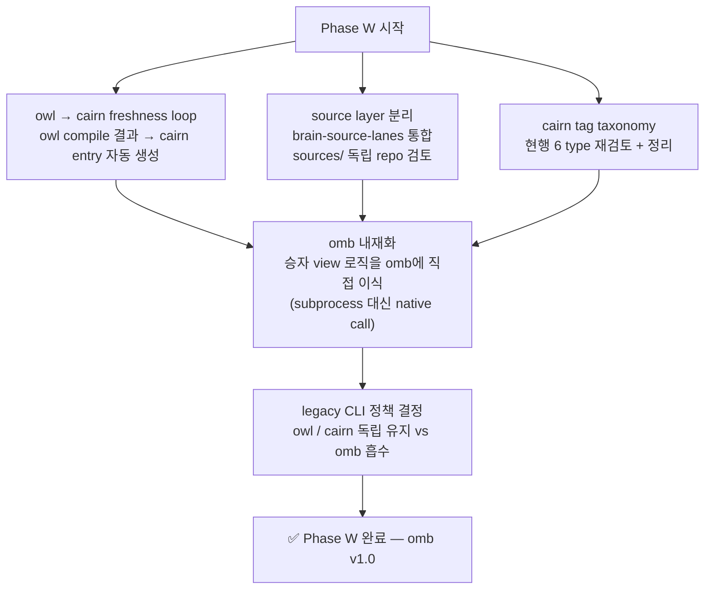

# oh-my-brain — 전체 계획 (2026)

개인 LLM-maintained 지식 시스템 **oh-my-brain(omb)**의 목표, 아키텍처, 로드맵을 한 문서에 기록한다.

---

## 1. 프로젝트 목적

> **"RAG가 아니라 잘 유지된 wiki가 답"** — Karpathy 2026

LLM 세션이 끝나도 지식이 쌓이는 시스템. 3가지 전략(owl / cairn / wiki)으로 동일 source를 운영하고 benchmark로 승자를 선택한다. 승자는 `omb` CLI에 네이티브로 통합된다.

---

## 2. 시스템 아키텍처



---

## 3. 지식 생애주기



---

## 4. 현재 상태 (2026-04-11)

| 항목 | 상태 |
|---|---|
| 리포 | `songblaq/oh-my-brain` · `~/_/projects/oh-my-brain` |
| Phase A–S | 완료 — owl 단독 18 phases + monorepo restructure |
| Phase omb | 완료 — unified CLI, GitHub rename, pipx reinstall |
| owl | v0.1.0 · raw 125 · compiled 233 · health 195 issues |
| cairn | v0.0.1 · entries 421 · Claude Code 연동 없음 |
| wiki | spec only (미구현) |
| omb | v0.1.0 · owl+cairn delegator · wiki placeholder |

---

## 5. 로드맵



---

## 6. Phase T — cairn Claude Code 연동

**목표:** cairn을 owl 수준의 Claude Code 시민으로 만든다.



### T 세부 태스크

| # | 작업 | 산출물 |
|---|---|---|
| T-1 | `/cairn-search` 슬래시 명령 | `views/cairn/src/cairn/claude_assets/commands/cairn-search.md` |
| T-2 | `/cairn-ingest` 슬래시 명령 | `views/cairn/src/cairn/claude_assets/commands/cairn-ingest.md` |
| T-3 | `cairn-scribe` 서브에이전트 | `views/cairn/src/cairn/claude_assets/agents/cairn-scribe.md` |
| T-4 | `cairn-auditor` 서브에이전트 | `views/cairn/src/cairn/claude_assets/agents/cairn-auditor.md` |
| T-5 | session_start hook (INDEX.md 주입) | `~/cairn-vault/.claude/settings.json` |
| T-6 | `cairn setup-claude` CLI 서브커맨드 | symlink 자동 등록 |
| T-7 | CLAUDE.md cairn 섹션 보강 | `~/.claude/CLAUDE.md` |

---

## 7. Phase U — 테스트 + CI

**목표:** 코드베이스에 pytest 기반 자동화 테스트와 GitHub Actions CI를 붙인다.



### U 세부 태스크

| # | 작업 |
|---|---|
| U-1 | `views/owl/tests/` pytest 초기화 |
| U-2 | owl search / health / vault roundtrip 테스트 |
| U-3 | `views/cairn/tests/` pytest 초기화 |
| U-4 | cairn entry CRUD + index 재생성 테스트 |
| U-5 | `views/omb/tests/` 통합 테스트 |
| U-6 | `.github/workflows/ci.yml` (Python 3.14, pytest, ruff) |

---

## 8. Phase V — wiki view + benchmark-v2

**목표:** wiki(pure Karpathy control group)를 구현하고 3-way 실전 benchmark를 수행한다.



---

## 9. Phase W — 동기화 + omb 수렴

**목표:** owl → cairn 자동 sync, source layer 독립, 최종적으로 omb에 승자 view를 내재화한다.



---

## 10. 핵심 설계 원칙

| 원칙 | 내용 |
|---|---|
| raw 불변 | `raw/` 파일은 읽기 전용. 수정 금지 |
| vault = 데이터만 | 코드는 repo에, 파생 데이터는 vault에 |
| view 독립 | 각 view는 서로의 산출물을 input으로 쓰지 않음 |
| rebuildable | source만 있으면 모든 view 재생성 가능 |
| CLI = decidable | CLI는 JSON 출력, LLM이 해석 |
| evidence 동반 | 기록 시 결과 + 근거(왜, 대안 비교, 검증) 함께 |
| omb wraps, doesn't replace | 점진 통합. 기존 CLI 호환 유지 |

---

## 11. 파일 지도

```
~/_/projects/oh-my-brain/
├── docs/
│   ├── plan-2026.md          ← 이 파일 (전체 계획)
│   ├── view-contract.md      view 인터페이스 계약
│   ├── source-layer-spec.md  source 불변 계약
│   ├── benchmark-v0.md       마이그레이션 benchmark
│   └── benchmark-v1.md       owl vs cairn full benchmark
├── views/
│   ├── owl/                  owl view (v0.1.0)
│   ├── cairn/                cairn view (v0.0.1)
│   ├── omb/                  unified CLI (v0.1.0)
│   └── wiki/                 spec only → Phase V
└── .github/
    └── workflows/ci.yml      → Phase U
```
